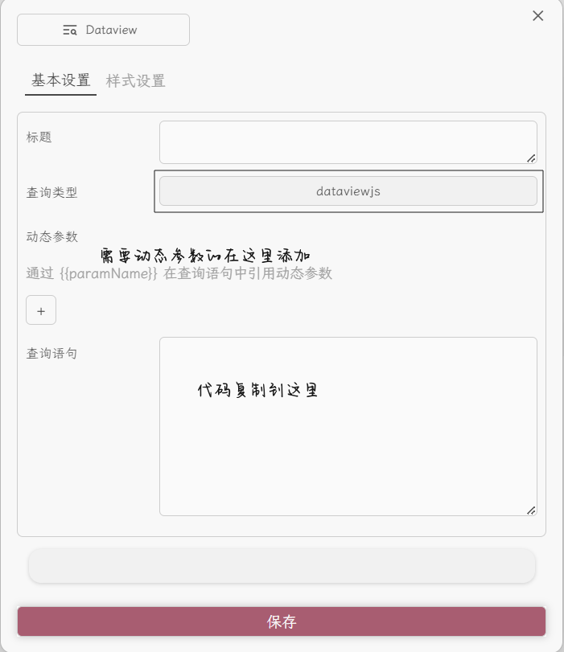
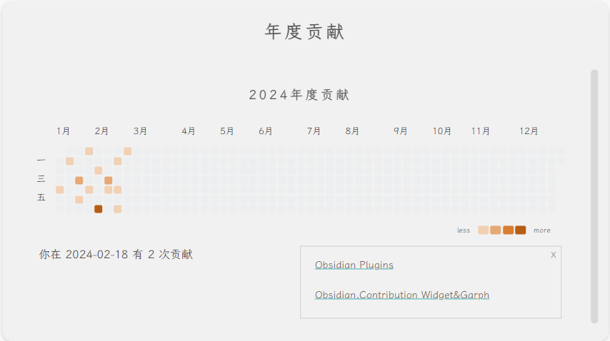
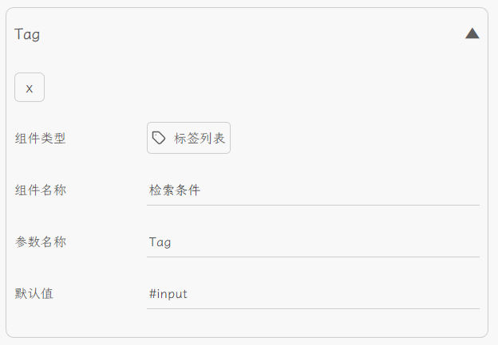
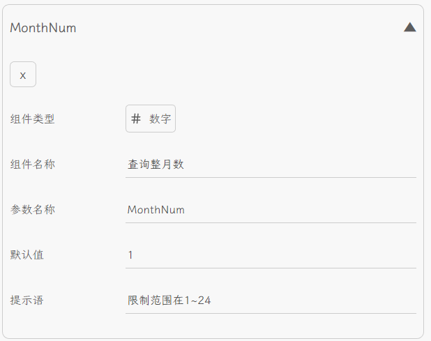
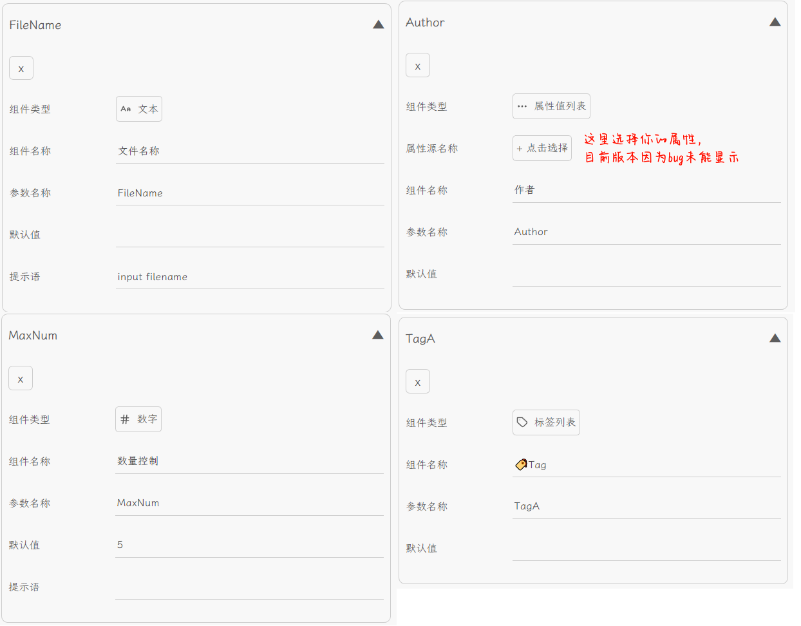
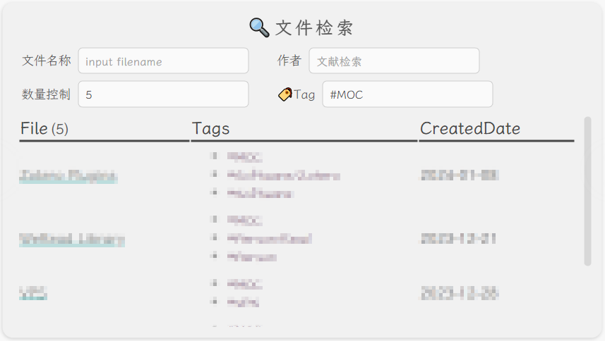
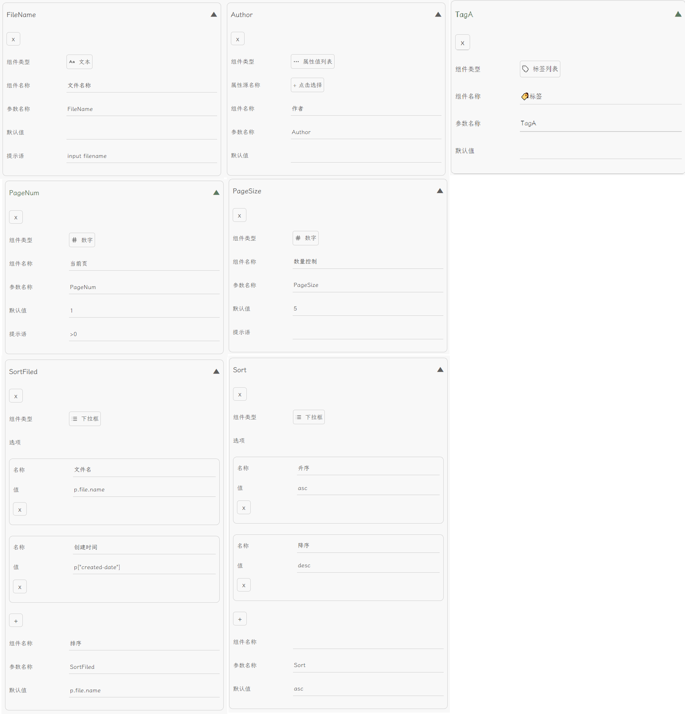
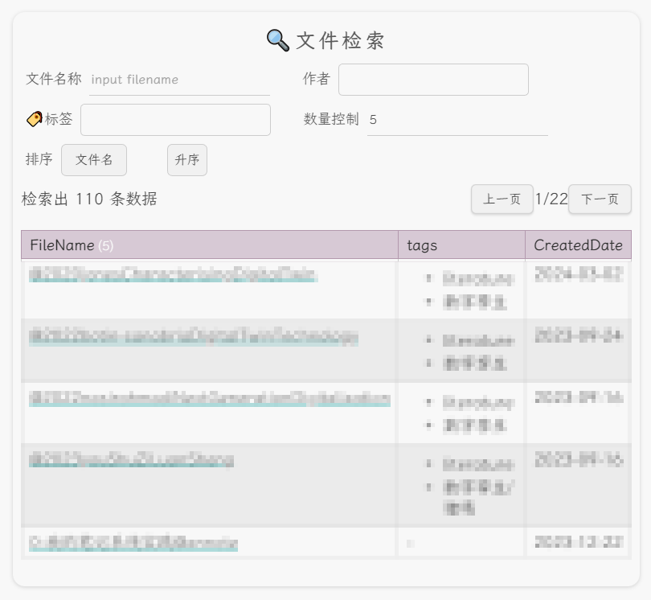
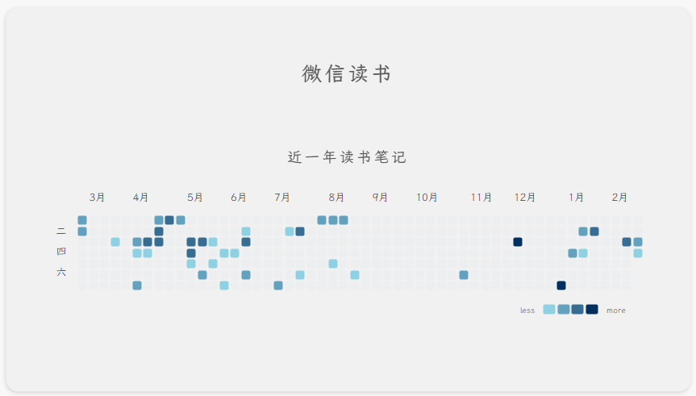
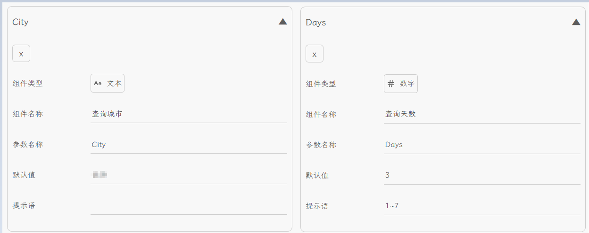

开发者文档[^readme_advance]
# 前置插件
- `Components`[^components] v20240411
- `Contribution Garph`[^contribution-garph] v0.9.0
- `dataview`[^dataview] v0.5.66

# 使用说明
！！！请仔细阅读文档，不是傻瓜式使用，需要自己修改参数才能达到理想的效果

本库存放Components插件的dataview组件代码

- 安装好三个必要前置插件

dataview插件需在设置中开启`Enable Inline JavaScript Queries`

- 鼠标右键创建挂件，选择dataview组件



- 根据代码注释修改参数

## 关于动态参数
动态参数的设置参考截图，需要注意：

- 参数名称必须设置得和截图一模一样！！！
- 组件名称可以根据喜好自定义，组件名称就是最终显示的筛选区域前的名称


## 关于dv.pages
dv.pages(`""`): 查询所有目录

dv.pages(`"temp"`): 只查询temp目录

dv.pages(`-"temp"`): 排除temp目录

多个目录使用and连接,比如

dv.pages(`-"temp" and -"demo"`): 排除temp和demo目录

## 关于文件创建时间
```js
// 这样的写法,是根据文件在Obsidian中的创建时间来分组
// 但是这样有一个问题,如果你的文件移动到其他设备,或者因为其他什么原因导致文件创建时间变动,会导致查询的结果发生变动
const data = dv.pages(`""`)
	.groupBy(p => p.file.ctime)
	.map(···)
	.values

// 所以就有了第二种方法,使用一个文档属性存储文件创建时间,比如使用created-date
// 那么代码需要修改成下面的样子
// 同时,需要在下方增加formatDate函数用于格式化你的日期字段
const data = dv.pages(`""`)
	.groupBy(p => formatDate(p["created-date"]))
	.map(···)
	.values

function formatDate(date) {
  const mdate = new Date(date)
  const year = String(mdate.getFullYear())
  const month = String(mdate.getMonth() + 1).padStart(2, '0')
  const day = String(mdate.getDate()).padStart(2, '0')
  return `${year}-${month}-${day}`
}
```


# 代码片段
均使用dataviewjs

## 热力图-年度贡献
自动获取今年年份,按照文件创建时间检索全库



```js
const currentYear = new Date().getFullYear()
const StartDate = new Date(currentYear, 0, 2)
const EndDate = new Date(currentYear, 12, 0)
const StartDateFormatted = StartDate.toISOString().split('T')[0]
const EndDateFormatted = EndDate.toISOString().split('T')[0]
const data = dv.pages('""')
.groupBy(p => p.file.ctime.toFormat('yyyy-MM-dd'))
.map(entry => {
return {
	date: entry.key,
	value: entry.rows.length,
	items: entry.rows.map(p => ({
        label: p.file.name,
        link: {
	          href: p.file.path,
	          className: "internal-link",
	          rel: 'noopener'
        },
        open: (e) => {app.workspace.openLinkText(p.file.name, p.file.path, e.ctrlKey)}
        }))
	}
})
const options = {
    title:  `${currentYear}年度贡献`,
    titleStyle:{
    fontSize: '14px',
    textAlign: 'center',
    },
    data: data,
    fromDate: StartDateFormatted,
    toDate: EndDateFormatted,
    cellStyleRules: [
    	{color: "#f1d0b4",
    	min: 1,
    	max: 3,
    	},
    	{
    	color: "#e6a875",
    	min: 3,
    	max: 10,
    	},
    	{
    	color: "#d97d31",
    	min: 10,
    	max: 50,
    	},
    	{
    	color: "#b75d13",
    	min: 50,
    	max: 999,
    	},
    ]
}
renderContributionGraph(this.container, options)
```

## 热力图-标签检索
1个动态参数: 
- 参数名称设置与截图一致
- 组件名称与默认值可自定义




```js
const tag = '{{Tag}}'
const data = dv.pages(`${tag} and -"_templates"`) //可以在这里排除某些目录
.groupBy(p => p.file.ctime.toFormat('yyyy-MM-dd'))
.map(entry => {
return { 
	date: entry.key, 
	value: entry.rows.length, 
	items: entry.rows.map(p => ({
        label: p.file.name,
        link: {
	          href: p.file.path,
	          className: "internal-link",
	          rel: 'noopener'
        },
        open: (e) => {app.workspace.openLinkText(p.file.name, p.file.path, e.ctrlKey)}
        }))
    }
}).values
const calendarData = {
	title: '',
	titleStyle: {
  		fontSize: '18px',
  		textAlign: 'center'
	},
	data: data,
	graphType: 'month-track',
	startOfWeek: 1,
	cellStyleRules: [
	  	{color: "#f1d0b4",
	   	min: 1,
	  	max: 3,
	  	},
	   	{color: "#e6a875",
	  	min: 3,
	   	max: 10,
	  	},
	   	{color: "#d97d31",
	  	min: 10,
	  	max: 50,
	  	},
	   	{color: "#b75d13",
	  	min: 50,
	   	max: 999,
	  	},
	  ]
}
renderContributionGraph(this.container, calendarData)
```

## 热力图-最近几个整月贡献
1个动态参数: 
- 参数名称设置与截图一致
- 组件名称与默认值可自定义




```js
const MonthNumPre = {{MonthNum}}
const MonthNum = MonthNumPre<=0 ? 1 : MonthNumPre>24 ? 24 : MonthNumPre
const currentDate = new Date()
const currentMonth = currentDate.getMonth()+1
const currentYear = currentDate.getFullYear()
const casualMonth = currentMonth-MonthNum
const i = Math.floor((-casualMonth)/12)+1
const FirstYear = casualMonth<0 ? currentYear-i : currentYear
const LastYear = currentYear
const FirstMonth = casualMonth<0 ? casualMonth+12*i : casualMonth
const LastMonth = currentMonth
const FirstDay = new Date(FirstYear,FirstMonth, 2)
const LastDay = new Date(LastYear, LastMonth, 1)
const FirstDayFormatted = FirstDay.toISOString().split('T')[0]
const LastDayFormatted = LastDay.toISOString().split('T')[0]
const data = dv.pages('""')
.groupBy(p => p.file.ctime.toFormat('yyyy-MM-dd'))
.map(entry => {
return {
date: entry.key,
value: entry.rows.length,
items: entry.rows.map(p => ({
        label: p.file.name,
        link: {
	          href: p.file.path,
	          className: "internal-link",
	          rel: 'noopener'
        },
        open: (e) => {app.workspace.openLinkText(p.file.name, p.file.path, e.ctrlKey)}
        }))
  }
})

const calendarData = {
    title: `最近${MonthNum}个整月贡献`,
    titleStyle:{
		fontSize: '14px',
		textAlign: 'center',
    },
    data: data, 
    graphType: 'month-track',
    startOfWeek: 1,
    fromDate: FirstDayFormatted, 
    toDate: LastDayFormatted,
    cellStyleRules: [
    	{color: "#f1d0b4",
    	min: 1,
    	max: 3,
    	},
    	{color: "#e6a875",
    	min: 3,
    	max: 10,
    	},
    	{color: "#d97d31",
    	min: 10,
    	max: 50,
    	},
    	{color: "#b75d13",
    	min: 50,
    	max: 999,
    	},
    ]
}
renderContributionGraph(this.container, calendarData)
```
## 文件检索器
4个动态参数:
- 参数名称设置与截图一致
- 组件名称与默认值可自定义





```js
const fileName = '{{FileName}}'
const author = '{{Author}}'
const tag = '{{TagA}}'
const maxResults = {{MaxNum}}
let filenameField = 'file.name' // `file.name` can be replaced with your filename field
let authorField = 'author' 		// `author` can be replaced with your author field
let tagField = 'file.tags' 		// `file.tags` can be replaced with your tag field
let query = `
table
  file.tags as Tags,
  dateformat(file.ctime, "yyyy-MM-dd") as CreatedDate
from
  ""
`
if (fileName && !author && !tag) {
  query += ` where (icontains(${filenameField}, "${fileName}"))`
} else if (!fileName && author && !tag) {
  query += ` where (icontains(${authorField}, "${author}"))`
} else if (!fileName && !author && tag) {
  query += ` where (contains(${tagField}, "${tag}"))`
} else if (fileName && author && !tag) {
  query += ` where (icontains(${filenameField}, "${fileName}") and icontains(${authorField}, "${author}"))`
} else if (fileName && !author && tag) {
  query += ` where (icontains(${filenameField}, "${fileName}") and contains(${tagField}, "${tag}"))`
} else if (!fileName && author && tag) {
  query += ` where (icontains(${authorField}, "${author}") and contains(${tagField}, "${tag}"))`
} else if (fileName && author && tag) {
  query += ` where (icontains(${filenameField}, "${fileName}") and icontains(${authorField}, "${author}") and contains(${tagField}, "${tag}"))`
} else {
  query += ``
}
query += ` limit ${maxResults}`
await dv.execute(query)
```

## 文件检索器(翻页第一版)
- 参考vran给出的代码
- 增加了分页功能，通过动态参数输入PageNum实现翻页效果
- 特点：效果稳定
- **注意**！SortFiled的下拉选项需要手动维护
	- `p.file.name`: 文件名
	- `p.file.ctime`: 文件创建时间
	- `p["created-date"]`: 文件中yaml区的created-date属性,可用于充当文件创建时间

7个动态参数：
- 参数名称设置与截图一致
- 组件名称与默认值可自
- `FileName` `Author` `TagA`无须设置默认值, 三者为空代表检索全部




```js
const dateFormat = "YYYY-MM-DD"
const headers = ["tags"] // 期望的展示的属性列表
const pageNum = {{PageNum}} // 当前页码
const pageSize = {{PageSize}} // 单页数量
const pageTitleLike = "{{FileName}}"
const authorLike = `{{Author}}`
const tagLike = "{{TagA}}"
const titleMatch = (page, title) => {
    return title ? page.file.name?.toLowerCase().includes(title.toLowerCase()) : true;
}
const authorMatch = (page, author) => {// page["author"]中的author替换为自己的作者属性
	return author&&page["author"] ? new RegExp(`.*${author}.*`, 'i').test(String(page["author"])) : false;
}
const tagMatch = (page, tag) => {
	return tag ? page.file.tags && page.file.tags.some(t => t.includes(tag)) : true;
}
const filteredData = dv.pages(`""`) //替换为你需要的查询位置
    .where(p => {
        if (pageTitleLike && !authorLike && !tagLike) {
            return titleMatch(p, pageTitleLike)
        } else if (!pageTitleLike && authorLike && !tagLike) {
            return authorMatch(p, authorLike)
        } else if (!pageTitleLike && !authorLike && tagLike) {
            return tagMatch(p, tagLike)
        } else if (pageTitleLike && authorLike && !tagLike) {
            return titleMatch(p, pageTitleLike) && authorMatch(p, authorLike)
        }
         else if (pageTitleLike && !authorLike && tagLike) {
            return titleMatch(p, pageTitleLike) && tagMatch(p, tagLike)
        }
         else if (!pageTitleLike && authorLike && tagLike) {
            return authorMatch(p, authorLike) && tagMatch(p, tagLike)
        }
         else if (pageTitleLike && authorLike && tagLike) {
            return titleMatch(p, pageTitleLike) && authorMatch(p, authorLike) && tagMatch(p, tagLike)
        }else{
	        return true
        }
    })
    .sort(p => {{SortFiled}},"{{Sort}}")
    .map(p => {
        return [p.file.link, ...headers.map(property => p[property]), moment(Number(p.file.ctime)).format(dateFormat)]
    })
const totalData = filteredData.length;
const pageData = filteredData.slice((pageNum - 1) * pageSize, pageNum * pageSize);
dv.paragraph("检索出 " + totalData + " 条数据");
dv.table(["FileName", ...headers, "CreatedDate"], pageData);
```

## 文件检索器(翻页第二版)
- 对比第一版，使用button按钮实现翻页效果
- 不一定有第一版稳定，可能会有奇奇怪怪的bug
- 关于动态参数，参考第一版即可，删除了PageNum参数



```js
const dateFormat = "YYYY-MM-DD"
const headers = ["tags"]
let pageNum = 1
const pageSize = {{PageSize}}
const pageTitleLike = "{{FileName}}"
const authorLike = "{{Author}}"
const tagLike = "{{TagA}}"
const titleMatch = (page, title) => {
    return title ? page.file.name?.toLowerCase().includes(title.toLowerCase()) : true;
}
const authorMatch = (page, author) => {// page["author"]中的author替换为自己的作者属性
	return author&&page["author"] ? new RegExp(`.*${author}.*`, 'i').test(String(page["author"])) : false;
}
const tagMatch = (page, tag) => {
	return tag ? page.file.tags && page.file.tags.some(t => t.includes(tag)) : true;
}
const filteredData = dv.pages(`""`) //替换为你需要的查询位置
    .where(p => {
        if (pageTitleLike && !authorLike && !tagLike) {
            return titleMatch(p, pageTitleLike)
        } else if (!pageTitleLike && authorLike && !tagLike) {
            return authorMatch(p, authorLike)
        } else if (!pageTitleLike && !authorLike && tagLike) {
            return tagMatch(p, tagLike)
        } else if (pageTitleLike && authorLike && !tagLike) {
            return titleMatch(p, pageTitleLike) && authorMatch(p, authorLike)
        }
         else if (pageTitleLike && !authorLike && tagLike) {
            return titleMatch(p, pageTitleLike) && tagMatch(p, tagLike)
        }
         else if (!pageTitleLike && authorLike && tagLike) {
            return authorMatch(p, authorLike) && tagMatch(p, tagLike)
        }
         else if (pageTitleLike && authorLike && tagLike) {
            return titleMatch(p, pageTitleLike) && authorMatch(p, authorLike) && tagMatch(p, tagLike)
        }else{
	        return true
        }
    })
    .sort(p => {{SortFiled}},"{{Sort}}")
    .map(p => {
        return [p.file.link, ...headers.map(property => p[property]), moment(Number(p.file.ctime)).format(dateFormat)]
    })
function formatDate(date) {
    const mdate = new Date(date);
    return `${mdate.getFullYear()}-${String(mdate.getMonth() + 1).padStart(2, '0')}-${String(mdate.getDate()).padStart(2, '0')}`;
}
const totalData = filteredData.length;
const maxnum = Math.ceil(totalData / pageSize);

let flexContainer = createFlexContainer("space-between");

let paragraph = dv.el("span", "检索出 " + totalData + " 条数据");
paragraph.style.flex = "1";
flexContainer.appendChild(paragraph);

let parentContainer = createFlexContainer("flex-end");
let [button1, button2, pageSpan1, pageSpan2, pageSpan3] = createPaginationElements();
parentContainer.append(button1, pageSpan1, pageSpan2, pageSpan3, button2);
flexContainer.appendChild(parentContainer);

function createPaginationElements() {
    let button1 = dv.el("button", "上一页");
    button1.onclick = () => {
        pageNum = pageNum > 1 ? pageNum - 1 : maxnum;
        fy();
    };
    let pageSpan1 = dv.el("span", pageNum);
    let pageSpan2 = dv.el("span", " / ");
    let pageSpan3 = dv.el("span", maxnum);
    let button2 = dv.el("button", "下一页");
    button2.onclick = () => {
        pageNum = pageNum < maxnum ? pageNum + 1 : 1;
        fy();
    };
    return [button1, button2, pageSpan1, pageSpan2, pageSpan3];
}
function createFlexContainer(justifyContent) {
    let container = dv.el("div", "");
    container.style.display = "flex";
    container.style.alignItems = "center";
    container.style.justifyContent = justifyContent;
    return container;
}

let table = dv.el("div", "")
function fy() {
  if(document.querySelector(".dataview.table-view-table")){
    document.querySelector(".dataview.table-view-table").remove();
  }
  let pageData = filteredData.slice((pageNum - 1) * pageSize, pageNum * pageSize);
  dv.table(["FileName", ...headers, "CreatedDate"], pageData, ".dataview.table-view-table");
  pageSpan1.innerText = pageNum;
}
fy();
```

## 微信读书笔记热力图
前置插件:
- `Weread`[^weread] v0.10.0



```js
const data = dv.pages(`"Linkages/WeRead"`) // `Linkages/WeRead` can be replaced with your path
  .groupBy(p => formatDate(p["readingDate"])) // `readingDate` can be replaced with your date field
  .map(group => {
    const createdDate = group.key
    let countsSum = 0
    let labeltemp
    let valuetemp
    const items = []
    group.rows.forEach(p => {
      countsSum += p["reviewCount"]+p["noteCount"] // `reviewCount`and`noteCount` can be replaced with your value field
      labeltemp = p.file.name
      valuetemp = p["reviewCount"]+p["noteCount"] // `reviewCount`and`noteCount` can be replaced with your value field
      labeltemp += ` [Counts:${valuetemp}]`
      const openLink = (e) => { app.workspace.openLinkText(p.file.name, p.file.path, e.ctrlKey) };
      items.push({
        label: labeltemp,
        value: valuetemp,
        link: {
	          href: p.file.path,
	          className: "internal-link",
	          rel: 'noopener'
        },
        open: openLink,
      })
    })
    return {
      date: createdDate,
      value: countsSum,
      items: items
    }
  }).values
function formatDate(date) {
  const mdate = new Date(date)
  const year = String(mdate.getFullYear())
  const month = String(mdate.getMonth() + 1).padStart(2, '0')
  const day = String(mdate.getDate()).padStart(2, '0')
  return `${year}-${month}-${day}`
}
const calendarData = {
    days: 366,
    title: `近一年读书笔记`,
    titleStyle:{
		fontSize: '14px',
		textAlign: 'center',
    },
    data: data, 
    graphType: 'default',
    startOfWeek: 1,
    cellStyleRules: [
    	{color: "#8dd1e2",
    	min: 1,
    	max: 6,
    	},
    	{color: "#63a1be",
    	min: 6,
    	max: 31,
    	},
    	{color: "#376d93",
    	min: 31,
    	max: 101,
    	},
    	{color: "#012f60",
    	min: 101,
    	max: 999,
    	},
    ]
}
renderContributionGraph(this.container, calendarData)
```

## 和风天气视图(转)
下载LumosLovegood大佬的js脚本[^WeatherView]

需要先按照WeatherView/Readme文档获取和风天气api以及js脚本

2个动态参数：




```js
let setting = {};
setting.key = ""; //Api key
setting.city = `{{City}}`;
setting.days = {{Days}};
setting.headerLevel = 0; //添加标题的等级,0为不添加
setting.addDesc = false; //是否添加描述
setting.onlyToday = false; //是否只在当天显示
setting.anotherCity = "北京"; //添加另外一个城市

// 脚本文件 weatherView.js 所在路径
dv.view("../_templates/Snippets/weatherView",setting)
```


[^readme_advance]: [obsidian-contribution-graph/README_ADVANCE.md](https://github.com/vran-dev/obsidian-contribution-graph/blob/master/README_ADVANCE.md)
[^components]: [vran-dev/obsidian-components-release: Obsidian missing components](https://github.com/vran-dev/obsidian-components-release)
[^contribution-garph]: [vran-dev/obsidian-contribution-graph: generate interactive gitxxx style contribution graph for obsidian, use it to track your goals, habits, or anything else you want to track](https://github.com/vran-dev/obsidian-contribution-graph)
[^dataview]: [blacksmithgu/obsidian-dataview: A data index and query language over Markdown files](https://github.com/blacksmithgu/obsidian-dataview)
[^weread]: [zhaohongxuan/obsidian-weread-plugin: Obsidian Weread Plugin is a plugin to sync Weread(微信读书) hightlights and annotations into your Obsidian Vault](https://github.com/zhaohongxuan/obsidian-weread-plugin)
[^WeatherView]: [LumosLovegood/myScripts/WeatherView](https://github.com/LumosLovegood/myScripts/blob/main/WeatherView/Readme.md)