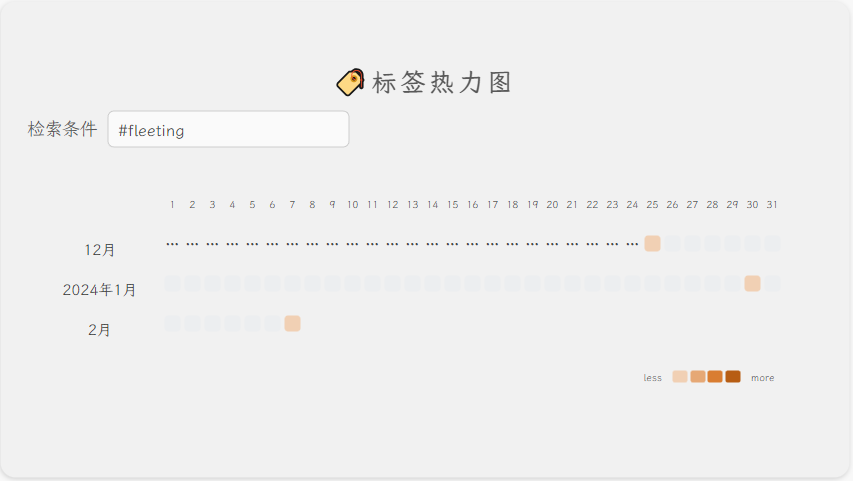
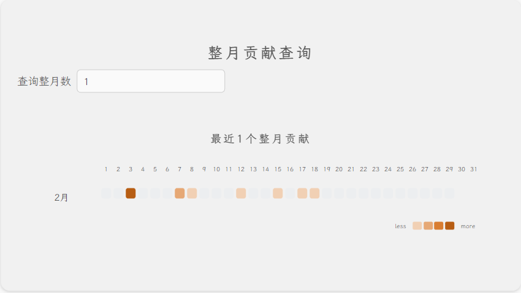
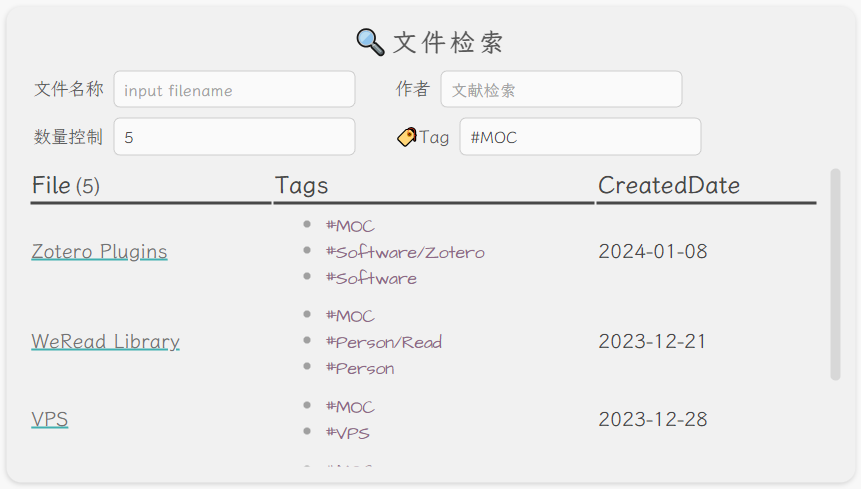

开发者文档[^readme_advance]
# 前置插件
- `Contribution Widget` v0217
- `Contribution Garph` v0.8.8
- `dataview` v0.5.64

# 代码片段

## 热力图-年度贡献
自动获取今年年份，按照文件创建时间检索全库


```js
const currentYear = new Date().getFullYear()
const StartDate = new Date(currentYear, 0, 2)
const EndDate = new Date(currentYear, 12, 0)
const StartDateFormatted = StartDate.toISOString().split('T')[0]
const EndDateFormatted = EndDate.toISOString().split('T')[0]
const data = dv.pages('""')
.groupBy(p => p.file.ctime.toFormat('yyyy-MM-dd'))
.map(entry => {
return {
	date: entry.key,
	value: entry.rows.length,
	items: entry.rows.map(p => ({
        label: p.file.name,
        link: p.file.path}))
	}
})
const options = {
    title:  `${currentYear}年度贡献`,
    titleStyle:{
    fontSize: '14px',
    textAlign: 'center',
    },
    data: data,
    fromDate: StartDateFormatted,
    toDate: EndDateFormatted,
    cellStyleRules: [
    	{color: "#f1d0b4",
    	min: 1,
    	max: 3,
    	},
    	{
    	color: "#e6a875",
    	min: 3,
    	max: 10,
    	},
    	{
    	color: "#d97d31",
    	min: 10,
    	max: 50,
    	},
    	{
    	color: "#b75d13",
    	min: 50,
    	max: 999,
    	},
    ]
}
renderContributionGraph(this.container, options)
```

## 热力图-标签检索
1个动态参数: 
- Tag
  - 组件类型: 标签列表
  - 参数名称: Tag



```js
const tag = '{{Tag}}'
const data = dv.pages(tag)
.groupBy(p => p.file.ctime.toFormat('yyyy-MM-dd'))
.map(entry => {
return { 
	date: entry.key, 
	value: entry.rows.length, 
	items: entry.rows.map(p => ({
        label: p.file.name,
        value: 123,
        link: p.file.path}))
    }
}).values
const calendarData = {
	title: '',
	titleStyle: {
  		fontSize: '18px',
  		textAlign: 'center'
	},
	data: data,
	graphType: 'month-track',
	startOfWeek: 1,
	cellStyleRules: [
	  	{color: "#f1d0b4",
	   	min: 1,
	  	max: 3,
	  	},
	   	{color: "#e6a875",
	  	min: 3,
	   	max: 10,
	  	},
	   	{color: "#d97d31",
	  	min: 10,
	  	max: 50,
	  	},
	   	{color: "#b75d13",
	  	min: 50,
	   	max: 999,
	  	},
	  ]
}
renderContributionGraph(this.container, calendarData)
```

## 热力图-最近几个整月贡献
1个动态参数: 
- MonthNum
  - 组件类型: 数字
  - 参数名称: MonthNum
  - 提示语: 限制范围:1~24




```js
const MonthNumPre = {{MonthNum}}
const MonthNum = MonthNumPre<=0 ? 1 : MonthNumPre>24 ? 24 : MonthNumPre
const currentDate = new Date()
const currentMonth = currentDate.getMonth()+1
const currentYear = currentDate.getFullYear()
const casualMonth = currentMonth-MonthNum
const i = Math.floor((-casualMonth)/12)+1
const FirstYear = casualMonth<0 ? currentYear-i : currentYear
const LastYear = currentYear
const FirstMonth = casualMonth<0 ? casualMonth+12*i : casualMonth
const LastMonth = currentMonth
const FirstDay = new Date(FirstYear,FirstMonth, 2)
const LastDay = new Date(LastYear, LastMonth, 1)
const FirstDayFormatted = FirstDay.toISOString().split('T')[0]
const LastDayFormatted = LastDay.toISOString().split('T')[0]
const data = dv.pages('""')
.groupBy(p => p.file.ctime.toFormat('yyyy-MM-dd'))
.map(entry => {
return {
date: entry.key,
value: entry.rows.length,
items: entry.rows.map(p => ({
        label: p.file.name,
        link: p.file.path}))
  }
})

const calendarData = {
    title: `最近${MonthNum}个整月贡献`,
    titleStyle:{
		fontSize: '14px',
		textAlign: 'center',
    },
    data: data, 
    graphType: 'month-track',
    startOfWeek: 1,
    fromDate: FirstDayFormatted, 
    toDate: LastDayFormatted,
    cellStyleRules: [
    	{color: "#f1d0b4",
    	min: 1,
    	max: 3,
    	},
    	{color: "#e6a875",
    	min: 3,
    	max: 10,
    	},
    	{color: "#d97d31",
    	min: 10,
    	max: 50,
    	},
    	{color: "#b75d13",
    	min: 50,
    	max: 999,
    	},
    ]
}
renderContributionGraph(this.container, calendarData)
```
## 文件检索器
4个动态参数:
- FileName(模糊匹配)
  - 组件类型: 文本
  - 参数名称: FileName
- Author(模糊匹配)
  - 组件类型: 文本
  - 参数名称: Author
- TagA
  - 组件类型: 标签列表
  - 参数名称: TagA
- MaxNum
  - 组件类型: 数字
  - 参数名称: MaxNum



```js
const fileName = '{{FileName}}'
const author = '{{Author}}'
const tag = '{{TagA}}'
const maxResults = {{MaxNum}}
// 在下面三个Field中替换为自己的属性，比如`author`可替换为`作者`
let filenameField = 'file.name'
let authorField = 'author'
let tagField = 'file.tags'
let query = `
table
  file.tags as Tags,
  dateformat(file.ctime, "yyyy-MM-dd") as CreatedDate
from
  !"_templates" and !"_excalidraw"
`
if (fileName && !author && !tag) {
  query += ` where (icontains(${filenameField}, "${fileName}"))`
} else if (!fileName && author && !tag) {
  query += ` where (icontains(${authorField}, "${author}"))`
} else if (!fileName && !author && tag) {
  query += ` where (contains(${tagField}, "${tag}"))`
} else if (fileName && author && !tag) {
  query += ` where (icontains(${filenameField}, "${fileName}") and icontains(${authorField}, "${author}"))`
} else if (fileName && !author && tag) {
  query += ` where (icontains(${filenameField}, "${fileName}") and contains(${tagField}, "${tag}"))`
} else if (!fileName && author && tag) {
  query += ` where (icontains(${authorField}, "${author}") and contains(${tagField}, "${tag}"))`
} else if (fileName && author && tag) {
  query += ` where (icontains(${filenameField}, "${fileName}") and icontains(${authorField}, "${author}") and contains(${tagField}, "${tag}"))`
} else {
  query += ``
}
query += ` limit ${maxResults}`
await dv.execute(query)
```


[^readme_advance]: [obsidian-contribution-graph/README_ADVANCE.md](https://github.com/vran-dev/obsidian-contribution-graph/blob/master/README_ADVANCE.md)