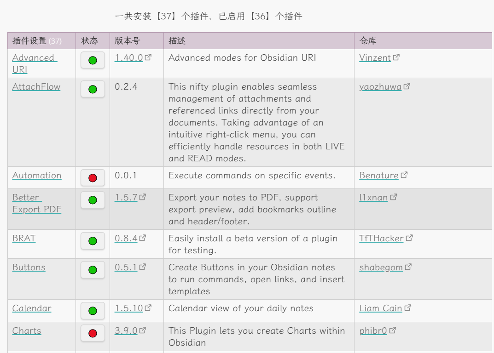

# 前置插件

- `Dataview`[^dataview] v0.5.66

# 代码片段

## 展示插件信息

源片段来自Blue-topaz主题示例库[^Blue-topaz-example-vault]
- 修改逻辑,第一次使用会自动将community-plugins.json下载到本地plugins-info.json
- 每次打开都会尝试更新一次plugins-info.json
- 按照插件名称排序,button插件始终为启用状态

前置插件:
- `Advanced URI`[^advance-url] v1.40.0
- `Buttons`[^buttons] v0.5.1



```dataviewjs
const plugins_url = 'https://raw.gitmirror.com/obsidianmd/obsidian-releases/master/community-plugins.json'; //可自行更换成其他加速访问方式
const localPluginsJsonPath = './.obsidian/plugins-info.json'; //设置本地文件路径变量,直接填库内的文件路径,填外部的绝对路径理论上也可以
let plugins_json = [];

// 更新和加载社区插件JSON,使用本地缓存作为回退
async function updateAndLoadPluginsJson() {
    try {
        // 尝试从远程URL获取最新的JSON数据
        let response = await request({ method: 'GET', url: plugins_url });
        plugins_json = JSON.parse(response);
        // 如果更新成功,写入新的JSON数据到本地存储
        await app.vault.adapter.write(localPluginsJsonPath, JSON.stringify(plugins_json));
    } catch (networkError) {
        // 如果网络请求失败,尝试读取本地文件
        try {
            let localData = await app.vault.adapter.read(localPluginsJsonPath);
            plugins_json = JSON.parse(localData);
        } catch (readError) {
            // 如果本地读取失败,检查文件是否存在
            try {
                await app.vault.adapter.stat(localPluginsJsonPath);
            } catch (statError) {
                // 文件不存在,先创建一个空的JSON文件
                await app.vault.adapter.write(localPluginsJsonPath, JSON.stringify([]));
            }
            // 再次尝试读取或设置默认值
            try {
                let localData = await app.vault.adapter.read(localPluginsJsonPath);
                plugins_json = JSON.parse(localData);
            } catch (finalReadError) {
                console.error('Failed to read local plugins JSON after creating:', finalReadError);
                plugins_json = []; // 设置默认值
            }
        }
    }
}
await updateAndLoadPluginsJson();
const {createButton} = app.plugins.plugins["buttons"];
const jump = async(id,state) => {
    if (state == "enable") {
        this.app.plugins.enablePluginAndSave(id);
        new Notice("Enabled " + id);
    }
    if (state == "disable") {
        this.app.plugins.disablePluginAndSave(id);
        new Notice("Disabled " + id);
    }
    setTimeout(async () => {
        let content = app.vault.adapter.read(dv.current().file.path);
        app.vault.adapter.append(dv.current().file.path, "\na");
        content.then(content => app.vault.adapter.write(dv.current().file.path, content));
    }, 10);
}
async function getinfo(id) {
    if (plugins_json.length === 0) {
        for (let i = 0; i < plugins_json.length; i++) {
            if (plugins_json[i].id === id) {
			        return plugins_json[i].repo
            }
        }
    } else {
        for (let i = 0; i < plugins_json.length; i++) {
            if (plugins_json[i].id === id) {
			        return plugins_json[i].repo
            }
        }
    }
}
dv.el("center", "一共安装【"+Object.keys(app.plugins.manifests).length+"】个插件，已启用【" + app.plugins.enabledPlugins.size + "】个插件");
// dv.el("br","")
let list = [];
for (let key of Object.keys(app.plugins.manifests)) {
    let manifest = app.plugins.manifests[key];
    let name = `<a href="obsidian://advanced-uri?settingid=${encodeURI(manifest.id)}">${manifest.name}</a>`;
    let status = app.plugins.enabledPlugins.has(key) ? "disable" : "enable";
    if (manifest.id == "buttons") status = "enable";
    let author = manifest?.author;
    let repo = await getInfo(manifest.id);
    let version = manifest?.version;
    if (repo) {
        version = `[${version}](https://ghproxy.com/https://github.com/${repo}/releases/tag/${version})`;
        repo = `[${author}](https://github.com/${repo})`;
    } else {
        repo = `[${author}](${manifest.authorUrl})`;
    }
    let description = manifest?.description;
    let button = createButton({
        app,
        el: this.container,
        args: {name: manifest.id == "buttons" ? '🟢' : (status == 'enable' ? '🔴' : '🟢'), class: 'tiny'},
        clickOverride: {click: jump, params: [manifest.id, status]}
    });
    let row = [name, button, version, description, repo];
    list.push(row);
}
list.sort((a, b) => a[1].innerHTML.includes("🔴") - b[1].innerHTML.includes("🔴"));
let sortedList = list.sort((a, b) => {
    let nameA = a[0].match(/>(.*?)<\/a>/)[1].toLowerCase();
    let nameB = b[0].match(/>(.*?)<\/a>/)[1].toLowerCase();
    return nameA.localeCompare(nameB);
});

dv.table(["插件设置", "状态", "版本号","描述","仓库"], sortedList)
```

## 今日进度条(彩虹猫样式)

```dataviewjs
function updateProgress() {
    const now = new Date();
    const startOfDay = new Date(now.getFullYear(), now.getMonth(), now.getDate());
    const endOfDay = new Date(now.getFullYear(), now.getMonth(), now.getDate() + 1);
    const secondsElapsedToday = (now - startOfDay) / 1000;
    const totalSecondsInDay = (endOfDay - startOfDay) / 1000;
    const todayProgress = Math.floor((secondsElapsedToday / totalSecondsInDay) * 100);

    const progressContainer = document.createElement('div');
    progressContainer.style.textAlign = 'center';

    const progressParagraph = document.createElement('p');
    progressParagraph.textContent = `今日进度：${todayProgress}%`; // 注释此行可屏蔽文字
    progressParagraph.style.margin = '10px 0'; // 设置上下边距
    progressContainer.appendChild(progressParagraph);

    const progressBar = document.createElement('progress');
    progressBar.className = 'nyan-cat';
    progressBar.value = todayProgress;
    progressBar.max = 100;
    progressBar.style.setProperty('--progress-value', todayProgress / 10);
    progressContainer.appendChild(progressBar);

    dv.container.innerHTML = '';
    dv.container.appendChild(progressContainer);
}

updateProgress();

// 每3s（3000毫秒）刷新一次进度
setInterval(updateProgress, 3000);
```

配合修改后的css使用,源片段来自来自AnubisNekhet[^AnubisNekhet]
```css
/* AGPLv3 License
Nyan Cat Progress Bars
Author: AnubisNekhet
Note: If you decide to implement it in your theme or redistribute it, please keep this comment (Especially for *certain* individuals who may try to rebrand it as their own :))
Support me: https://buymeacoffee.com/AnubisNekhet
*/
.markdown-preview-view progress[value][max="100"][class*=nyan-cat]::-webkit-progress-bar,
.markdown-rendered progress[value][max="100"][class*=nyan-cat]::-webkit-progress-bar,
.markdown-source-view.is-live-preview progress[value][max="100"][class*=nyan-cat]::-webkit-progress-bar {
  background-color: var(--background-secondary);
  box-shadow: none;
  border-radius: 6px;
  overflow: hidden;
}

.markdown-preview-view progress[value][max="100"][class*=nyan-cat]::-webkit-progress-bar,
.markdown-rendered progress[value][max="100"][class*=nyan-cat]::-webkit-progress-bar,
.markdown-source-view.is-live-preview progress[value][max="100"][class*=nyan-cat]::-webkit-progress-bar {
  background: url("data:image/gif;base64,R0lGODlhMAAMAIAAAAxBd////yH/C05FVFNDQVBFMi4wAwEAAAAh+QQECgAAACwAAAAAMAAMAAACJYSPqcvtD6MKstpLr24Z9A2GYvJ544mhXQmxoesElIyCcB3dRgEAIfkEBAoAAAAsAQACAC0ACgAAAiGEj6nLHG0enNQdWbPefOHYhSLydVhJoSYXPO04qrAmJwUAIfkEBAoAAAAsBQABACkACwAAAiGEj6nLwQ8jcC5ViW3evHt1GaE0flxpphn6BNTEqvI8dQUAIfkEBAoAAAAsAQABACoACwAAAiGEj6nLwQ+jcU5VidPNvPtvad0GfmSJeicUUECbxnK0RgUAIfkEBAoAAAAsAAAAACcADAAAAiCEj6mbwQ+ji5QGd6t+c/v2hZzYiVpXmuoKIikLm6hXAAAh+QQECgAAACwAAAAALQAMAAACI4SPqQvBD6NysloTXL480g4uX0iW1Wg21oem7ismLUy/LFwAACH5BAQKAAAALAkAAAAkAAwAAAIghI8Joe0Po0yBWTaz3g/z7UXhMX7kYmplmo0rC8cyUgAAIfkEBAoAAAAsBQAAACUACgAAAh2Ejwmh7Q+jbIFZNrPeEXPudU74IVa5kSiYqOtRAAAh+QQECgAAACwEAAAAIgAKAAACHISPELfpD6OcqTGKs4bWRp+B36YFi0mGaVmtWQEAIfkEBAoAAAAsAAAAACMACgAAAh2EjxC36Q+jnK8xirOW1kavgd+2BYtJhmnpiGtUAAAh+QQECgAAACwAAAAALgALAAACIYSPqcvtD+MKicqLn82c7e6BIhZQ5jem6oVKbfdqQLzKBQAh+QQECgAAACwCAAIALAAJAAACHQx+hsvtD2OStDplKc68r2CEm0eW5uSN6aqe1lgAADs=");
}

.markdown-preview-view progress[value][max="100"][class*=nyan-cat]::after,
.markdown-rendered progress[value][max="100"][class*=nyan-cat]::after,
.markdown-source-view.is-live-preview progress[value][max="100"][class*=nyan-cat]::after {
  background: url("data:image/gif;base64,R0lGODlhIgAVAKIHAL3/9/+Zmf8zmf/MmZmZmf+Z/wAAAAAAACH/C05FVFNDQVBFMi4wAwEAAAAh/wtYTVAgRGF0YVhNUDw/eHBhY2tldCBiZWdpbj0i77u/IiBpZD0iVzVNME1wQ2VoaUh6cmVTek5UY3prYzlkIj8+IDx4OnhtcG1ldGEgeG1sbnM6eD0iYWRvYmU6bnM6bWV0YS8iIHg6eG1wdGs9IkFkb2JlIFhNUCBDb3JlIDUuMy1jMDExIDY2LjE0NTY2MSwgMjAxMi8wMi8wNi0xNDo1NjoyNyAgICAgICAgIj4gPHJkZjpSREYgeG1sbnM6cmRmPSJodHRwOi8vd3d3LnczLm9yZy8xOTk5LzAyLzIyLXJkZi1zeW50YXgtbnMjIj4gPHJkZjpEZXNjcmlwdGlvbiByZGY6YWJvdXQ9IiIgeG1sbnM6eG1wTU09Imh0dHA6Ly9ucy5hZG9iZS5jb20veGFwLzEuMC9tbS8iIHhtbG5zOnN0UmVmPSJodHRwOi8vbnMuYWRvYmUuY29tL3hhcC8xLjAvc1R5cGUvUmVzb3VyY2VSZWYjIiB4bWxuczp4bXA9Imh0dHA6Ly9ucy5hZG9iZS5jb20veGFwLzEuMC8iIHhtcE1NOk9yaWdpbmFsRG9jdW1lbnRJRD0ieG1wLmRpZDpDMkJBNjY5RTU1NEJFMzExOUM4QUM2MDAwNDQzRERBQyIgeG1wTU06RG9jdW1lbnRJRD0ieG1wLmRpZDpCREIzOEIzMzRCN0IxMUUzODhEQjgwOTYzMTgyNTE0QiIgeG1wTU06SW5zdGFuY2VJRD0ieG1wLmlpZDpCREIzOEIzMjRCN0IxMUUzODhEQjgwOTYzMTgyNTE0QiIgeG1wOkNyZWF0b3JUb29sPSJBZG9iZSBQaG90b3Nob3AgQ1M2IChXaW5kb3dzKSI+IDx4bXBNTTpEZXJpdmVkRnJvbSBzdFJlZjppbnN0YW5jZUlEPSJ4bXAuaWlkOkM1QkE2NjlFNTU0QkUzMTE5QzhBQzYwMDA0NDNEREFDIiBzdFJlZjpkb2N1bWVudElEPSJ4bXAuZGlkOkMyQkE2NjlFNTU0QkUzMTE5QzhBQzYwMDA0NDNEREFDIi8+IDwvcmRmOkRlc2NyaXB0aW9uPiA8L3JkZjpSREY+IDwveDp4bXBtZXRhPiA8P3hwYWNrZXQgZW5kPSJyIj8+Af/+/fz7+vn49/b19PPy8fDv7u3s6+rp6Ofm5eTj4uHg397d3Nva2djX1tXU09LR0M/OzczLysnIx8bFxMPCwcC/vr28u7q5uLe2tbSzsrGwr66trKuqqainpqWko6KhoJ+enZybmpmYl5aVlJOSkZCPjo2Mi4qJiIeGhYSDgoGAf359fHt6eXh3dnV0c3JxcG9ubWxramloZ2ZlZGNiYWBfXl1cW1pZWFdWVVRTUlFQT05NTEtKSUhHRkVEQ0JBQD8+PTw7Ojk4NzY1NDMyMTAvLi0sKyopKCcmJSQjIiEgHx4dHBsaGRgXFhUUExIREA8ODQwLCgkIBwYFBAMCAQAAIfkECQcABwAsAAAAACIAFQAAA6J4umv+MDpG6zEj682zsRaWFWRpltoHMuJZCCRseis7xG5eDGp93bqCA7f7TFaYoIFAMMwczB5EkTzJllEUttmIGoG5bfPBjDawD7CsJC67uWcv2CRov929C/q2ZpcBbYBmLGk6W1BRY4MUDnMvJEsBAXdlknk2fCeRk2iJliAijpBlEmigjR0plKSgpKWvEUheF4tUZqZID1RHjEe8PsDBBwkAIfkECQcABwAsAAAAACIAFQAAA6B4umv+MDpG6zEj682zsRaWFWRpltoHMuJZCCRseis7xG5eDGp93TqS40XiKSYgTLBgIBAMqE/zmQSaZEzns+jQ9pC/5dQJ0VIv5KMVWxqb36opxHrNvu9ptPfGbmsBbgSAeRdydCdjXWRPchQPh1hNAQF4TpM9NnwukpRyi5chGjqJEoSOIh0plaYsZBKvsCuNjY5ptElgDyFIuj6+vwcJACH5BAkHAAcALAAAAAAiABUAAAOfeLrc/vCZSaudUY7Nu99GxhhcYZ7oyYXiQQ5pIZgzCrYuLMd8MbAiUu802flYGIhwaCAQDKpQ86nUoWqF6dP00wIby572SXE6vyMrlmhuu9GKifWaddvNQAtszXYCxgR/Zy5jYTFeXmSDiIZGdQEBd06QSBQ5e4cEkE9nnZQaG2J4F4MSLx8rkqUSZBeurhlTUqsLsi60DpZxSWBJugcJACH5BAkHAAcALAAAAAAiABUAAAOgeLrc/vCZSaudUY7Nu99GxhhcYZ7oyYXiQQ5pIZgzCrYuLMd8MbAiUu802flYGIhwaCAQDKpQ86nUoWqF6dP00wIby572SXE6vyMrlmhuu9GuifWaddvNwMkZtmY7AWMEgGcKY2ExXl5khFMVc0Z1AQF3TpJShDl8iASST2efloV5JTyJFpgOch8dgW9KZxexshGNLqgLtbW0SXFwvaJfCQAh+QQJBwAHACwAAAAAIgAVAAADoXi63P7wmUmrnVGOzbvfRsYYXGGe6MmF4kEOaSGYMwq2LizHfDGwIlLPNKGZfi6gZmggEAy2iVPZEKZqzakq+1xUFFYe90lxTsHmim6HGpvf3eR7skYJ3PC5tyystc0AboFnVXQ9XFJTZIQOYUYFTQEBeWaSVF4bbCeRk1meBJYSL3WbaReMIxQfHXh6jaYXsbEQni6oaF21ERR7l0ksvA0JACH5BAkHAAcALAAAAAAiABUAAAOeeLrc/vCZSaudUY7Nu99GxhhcYZ7oyYXiQQ5pIZgzCrYuLMfFlA4hTITEMxkIBMOuADwmhzqeM6mashTCXKw2TVKQyKuTRSx2wegnNkyJ1ozpOFiMLqcEU8BZHx6NYW8nVlZefQ1tZgQBAXJIi1eHUTRwi0lhl48QL0sogxaGDhMlUo2gh14fHhcVmnOrrxNqrU9joX21Q0IUElm7DQkAIfkECQcABwAsAAAAACIAFQAAA6J4umv+MDpG6zEj682zsRaWFWRpltoHMuJZCCRseis7xG5eDGp93bqCA7f7TFaYoIFAMMwczB5EkTzJllEUttmIGoG5bfPBjDawD7CsJC67uWcv2CRov929C/q2ZpcBbYBmLGk6W1BRY4MUDnMvJEsBAXdlknk2fCeRk2iJliAijpBlEmigjR0plKSgpKWvEUheF4tUZqZID1RHjEe8PsDBBwkAIfkECQcABwAsAAAAACIAFQAAA6B4umv+MDpG6zEj682zsRaWFWRpltoHMuJZCCRseis7xG5eDGp93TqS40XiKSYgTLBgIBAMqE/zmQSaZEzns+jQ9pC/5dQJ0VIv5KMVWxqb36opxHrNvu9ptPfGbmsBbgSAeRdydCdjXWRPchQPh1hNAQF4TpM9NnwukpRyi5chGjqJEoSOIh0plaYsZBKvsCuNjY5ptElgDyFIuj6+vwcJACH5BAkHAAcALAAAAAAiABUAAAOfeLrc/vCZSaudUY7Nu99GxhhcYZ7oyYXiQQ5pIZgzCrYuLMd8MbAiUu802flYGIhwaCAQDKpQ86nUoWqF6dP00wIby572SXE6vyMrlmhuu9GKifWaddvNQAtszXYCxgR/Zy5jYTFeXmSDiIZGdQEBd06QSBQ5e4cEkE9nnZQaG2J4F4MSLx8rkqUSZBeurhlTUqsLsi60DpZxSWBJugcJACH5BAkHAAcALAAAAAAiABUAAAOgeLrc/vCZSaudUY7Nu99GxhhcYZ7oyYXiQQ5pIZgzCrYuLMd8MbAiUu802flYGIhwaCAQDKpQ86nUoWqF6dP00wIby572SXE6vyMrlmhuu9GuifWaddvNwMkZtmY7AWMEgGcKY2ExXl5khFMVc0Z1AQF3TpJShDl8iASST2efloV5JTyJFpgOch8dgW9KZxexshGNLqgLtbW0SXFwvaJfCQAh+QQJBwAHACwAAAAAIgAVAAADoXi63P7wmUmrnVGOzbvfRsYYXGGe6MmF4kEOaSGYMwq2LizHfDGwIlLPNKGZfi6gZmggEAy2iVPZEKZqzakq+1xUFFYe90lxTsHmim6HGpvf3eR7skYJ3PC5tyystc0AboFnVXQ9XFJTZIQOYUYFTQEBeWaSVF4bbCeRk1meBJYSL3WbaReMIxQfHXh6jaYXsbEQni6oaF21ERR7l0ksvA0JACH5BAkHAAcALAAAAAAiABUAAAOeeLrc/vCZSaudUY7Nu99GxhhcYZ7oyYXiQQ5pIZgzCrYuLMfFlA4hTITEMxkIBMOuADwmhzqeM6mashTCXKw2TVKQyKuTRSx2wegnNkyJ1ozpOFiMLqcEU8BZHx6NYW8nVlZefQ1tZgQBAXJIi1eHUTRwi0lhl48QL0sogxaGDhMlUo2gh14fHhcVmnOrrxNqrU9joX21Q0IUElm7DQkAOw==") !important;
}

.markdown-preview-view progress[value][max="100"][class*=nyan-cat]::-webkit-progress-value,
.markdown-rendered progress[value][max="100"][class*=nyan-cat]::-webkit-progress-value,
.markdown-source-view.is-live-preview progress[value][max="100"][class*=nyan-cat]::-webkit-progress-value {
  background: linear-gradient(to bottom, #FF0000 0%, #FF0000 16.5%, #FF9900 16.5%, #FF9900 33%, #FFFF00 33%, #FFFF00 50%, #33FF00 50%, #33FF00 66%, #0099FF 66%, #0099FF 83.5%, #6633ff 83.5%, #6633ff 100%) !important;
  overflow: hidden;
}

.markdown-preview-view progress[value][max="100"][class*=nyan-cat]::after,
.markdown-rendered progress[value][max="100"][class*=nyan-cat]::after,
.markdown-source-view.is-live-preview progress[value][max="100"][class*=nyan-cat]::after {
  content: "";
  width: 30px;
  height: 24px;
  background-size: contain !important;
  position: absolute;
  margin-top: -16px;
  background-repeat: no-repeat !important;
}

.markdown-preview-view progress[value][max="100"][class*=nyan-cat], .markdown-rendered progress[value][max="100"][class*=nyan-cat], .markdown-source-view.is-live-preview progress[value][max="100"][class*=nyan-cat] {
  -webkit-writing-mode: horizontal-tb;
  writing-mode: horizontal-tb;
  appearance: none;
  box-sizing: border-box;
  display: inline-block;
  height: 14px;
  margin-bottom: 4px;
  max-width: 100%;
  overflow: hidden;
  border-radius: 0px;
  border: 0;
  vertical-align: -0.2rem;
}

.markdown-preview-view progress[value][max="100"][class*=nyan-cat]::after,
.markdown-rendered progress[value][max="100"][class*=nyan-cat]::after,
.markdown-source-view.is-live-preview progress[value][max="100"][class*=nyan-cat]::after {
  margin-left: calc(var(--progress-value) * 1em - 100px); //可根据实际需要修改100px为其他值,比如原版此处为20px
}
```


## 查询指定标签行内容

源片段来自代码咖啡豆obsidian文档站[^Dvjs-QueryTags-inlineKeywords]
- 修改逻辑,查询指定路径(可多个)中的笔记
- 排除代码块中标签影响
- 作用: 显示笔记中具有制定标签的行内容

```dataviewjs
const pathsToInclude = ["1", "2", "3"]; //自定义想要查询的路径
const tag = `#tag1`; //自定义想要查询的标签
const files = app.vault.getMarkdownFiles().filter(file => {
    return pathsToInclude.some(path => file.path.includes(path));
});


let arr = files.map(async (file) => {
    const content = await app.vault.cachedRead(file);
    let isInCodeBlock = false;
    let lines = content.split('\n').filter(line => {
	    if (line.trim().startsWith("```")) { // 检测代码块的开始和结束
            isInCodeBlock = !isInCodeBlock;
        }
        if (isInCodeBlock) return false;
	    let tagCondition = line.includes(tag);
	    return tagCondition;
	    })
        .map(line => line
            .replace(/- /g, '')
            .replace(/  /g, '')
            .replace(tag, '')
        );
    return ["[[" + file.name.split(".")[0] + "]]", lines];
});


Promise.all(arr).then(values => {
    const exists = values.filter(value => value[1].length > 0);
    dv.table(["文件", "内容"], exists);
});
```

## 查询指定标签行内容V2

增加功能: 排除包含不希望显示的标签的行

```dataviewjs
const pathsToInclude = ["Inbox", "Linkages"]; // 自定义需要查询的路径
const tags = ["#fleeting", "#done"]; // 自定义想要查询的标签列表
const excludeTags = ["#ignore", "#exclude"]; // 自定义希望排除的标签列表
const files = app.vault.getMarkdownFiles().filter(file => {
    return pathsToInclude.some(path => file.path.includes(path));
});

let arr = files.map(async (file) => {
    const content = await app.vault.cachedRead(file);
    let isInCodeBlock = false; // 用于追踪当前是否在代码块中
    let linesWithAnyTagButWithoutExcludeTags = content.split('\n').filter(line => {
        if (line.trim().startsWith("```")) { // 检测代码块的开始和结束
            isInCodeBlock = !isInCodeBlock;
        }
        if (isInCodeBlock) return false;
        let tagCondition = tags.some(tag => line.includes(tag));
        let excludeCondition = !excludeTags.some(tag => line.includes(tag)); 
        return tagCondition && excludeCondition;
    })
    .map(line => line
        .replace(/- /g, '')
        .replace(/  /g, '')
        // .replace(new RegExp([...tags, ...excludeTags].join('|'), 'g'), '') // 不显示所有tag
    );

    return linesWithAnyTagButWithoutExcludeTags.length > 0 ? ["[[" + file.name.split(".")[0] + "]]", linesWithAnyTagButWithoutExcludeTags] : null;
});

Promise.all(arr).then(values => {
    const exists = values.filter(value => value); // 确保内容非空
    dv.table(['文件', '内容'], exists);
});
```

## 查询显示往年日记

脚本以当前日记笔记的文件名为时间节点进行查询,需放在日记中使用

```dataviewjs
const { DateTime } = dv.luxon; 
const currentDate = DateTime.fromISO(dv.current().file.name);

// 可自定义需要显示的标题列表
const customTitles = ["今日日记", "个人思考", "工作总结"];

let output = '';
for (let i = 1; i <= 4; i++) {
  const date = currentDate.minus({ years: i }).toISODate();
  output += `### ${date}\n`;
  for (const title of customTitles) {
    output += `![[${date}#${title}]]\n`;
  }
}
dv.header(3, output);
```


[^dataview]: [blacksmithgu/obsidian-dataview: A data index and query language over Markdown files](https://github.com/blacksmithgu/obsidian-dataview)
[^Blue-topaz-example-vault]: [Blue-topaz-example](https://github.com/PKM-er/Blue-topaz-example)
[^advance-url]: [shabegom/buttons: Buttons in Obsidian (github.com)](https://github.com/shabegom/buttons)
[^buttons]: [Vinzent03/obsidian-advanced-uri: Advanced modes for Obsidian URI (github.com)](https://github.com/Vinzent03/obsidian-advanced-uri)
[^AnubisNekhet]: [AnubisNekhet](https://github.com/AnubisNekhet)
[^Dvjs-QueryTags-inlineKeywords]: [dataview-限定标签-显示关键字所在行 | obsidian文档咖啡豆版](https://obsidian.vip/zh/dataview-snippets/Dvjs-QueryTags-inlineKeywords.html)
