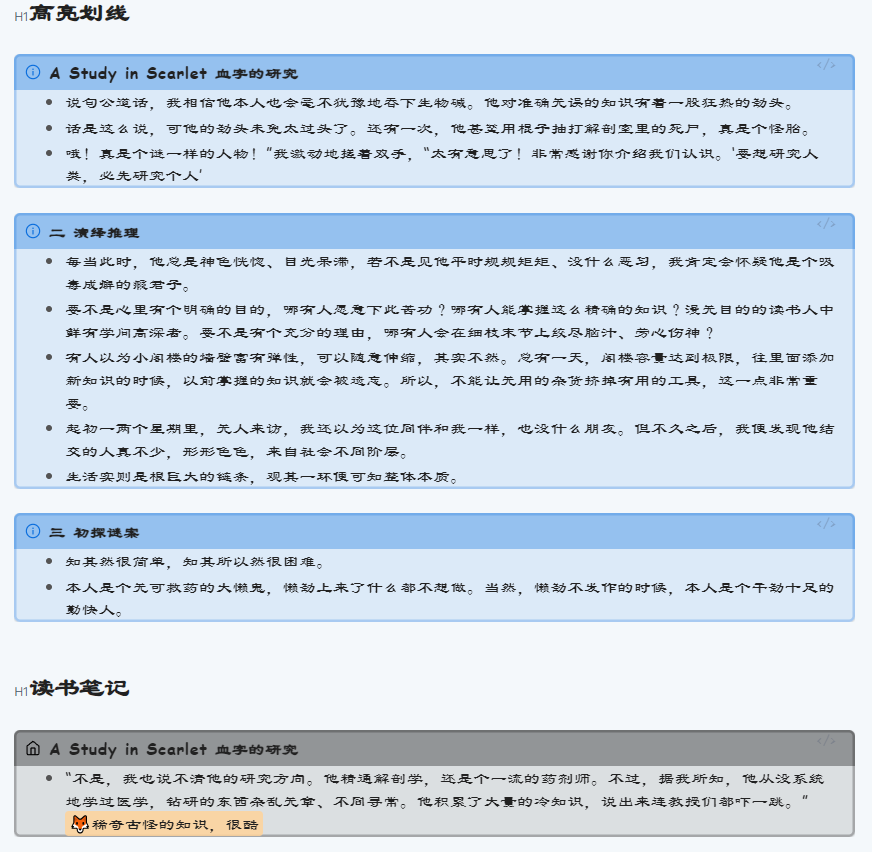
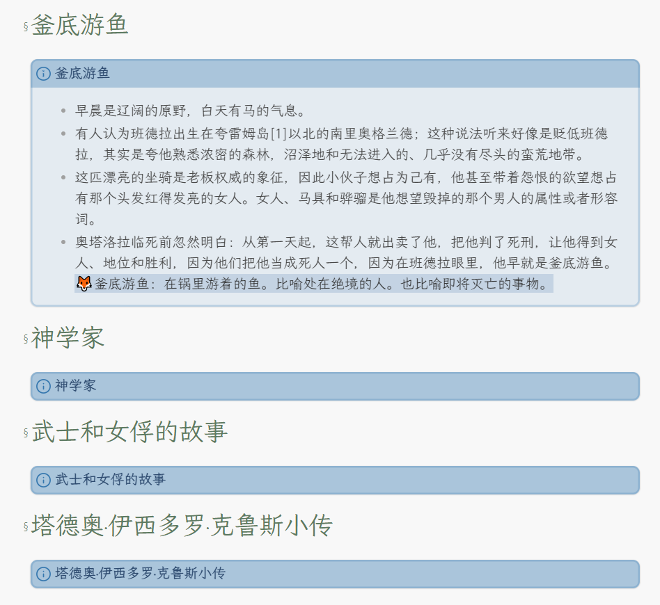
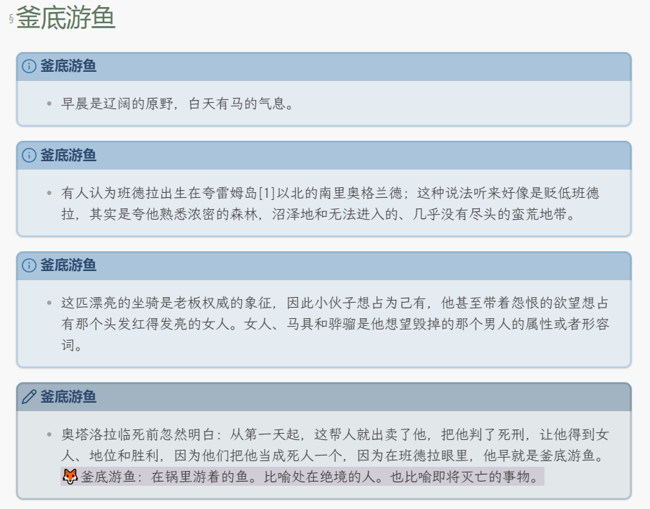

GitHub分享模板区[^模板分享区]

# 前置插件
- `Weread` v0.8.4


# 模板片段
## 模板1


```js
---
title: {{metaData.title}}
pcUrl: {{metaData.pcUrl}}
lastReadDate: {{metaData.lastReadDate}}
---
> [!abstract] {{metaData.title}}
> - 

# 高亮划线

## {{chapter.chapterTitle}}### {{chapter.chapterTitle}}#### {{chapter.chapterTitle}}
> [!INFO] {{chapter.chapterTitle}}
> - {{ highlight.markText |trim }} ^{{highlight.chapterUid}}-{{highlight.range}}

# 读书笔记

> [!NOTE] {{chapter.chapterTitle}}
> - {{chapterReview.content}}

> - {{review.abstract |trim }}
>   ==🦊{{review.content}}==
  
# 本书评论

{{loop.index}}. {{bookReview.mdContent}}

```

## 模板2
此模板要求每个想法都要高亮
```js
---
title: {{metaData.title}}
pcUrl: {{metaData.pcUrl}}
lastReadDate: {{metaData.lastReadDate}}
---
> [!abstract] {{metaData.title}}
> - 


## {{chapter.chapterTitle}}### {{chapter.chapterTitle}}#### {{chapter.chapterTitle}}
> [!INFO] {{chapter.chapterTitle}}
> - {{ highlight.markText |trim }} 
>   ==🦊{{highlight.reviewContent}}==
> - {{ highlight.markText |trim }} 
```

## 模板3


```js
---
title: {{metaData.title}}
pcUrl: {{metaData.pcUrl}}
lastReadDate: {{metaData.lastReadDate}}
---
> [!abstract] {{metaData.title}}
> - 

## {{chapter1.chapterTitle}}### {{chapter1.chapterTitle}}#### {{chapter1.chapterTitle}}
> [!INFO] {{chapter1.chapterTitle}}
> - {{ highlight.markText |trim }} ^{{highlight.chapterUid}}-{{highlight.range}}
> - {{chapterReview.content}}
> - {{review.abstract |trim }}
>   ==🦊{{review.content}}==
```

## 模板4


```js
---
title: {{metaData.title}}
pcUrl: {{metaData.pcUrl}}
lastReadDate: {{metaData.lastReadDate}}
---
> [!abstract] {{metaData.title}}
> - 

## {{chapter1.chapterTitle}}### {{chapter1.chapterTitle}}#### {{chapter1.chapterTitle}}

> [!INFO] {{chapter1.chapterTitle}}
> - {{ highlight.markText |trim }} ^{{highlight.chapterUid}}-{{highlight.range}}

> - {{chapterReview.content}}
> [!NOTE] {{chapter2.chapterTitle}}
> - {{review.abstract |trim }}
>   ==🦊{{review.content}}==

```

[^模板分享区]: [obsidian-weread-plugin/discussions/62#discussioncomment-7236718](https://github.com/zhaohongxuan/obsidian-weread-plugin/discussions/62#discussioncomment-7236718)