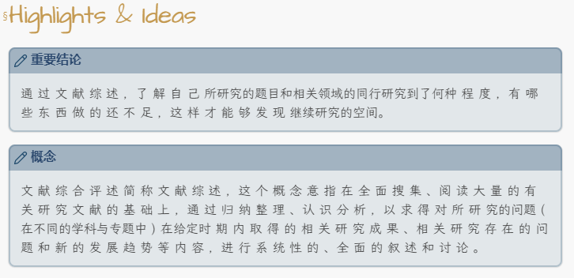
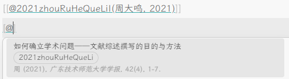
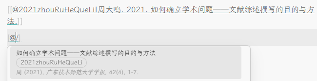
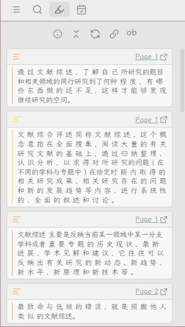
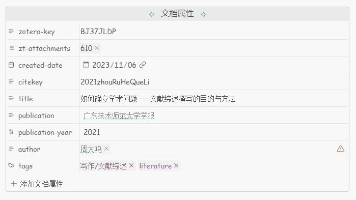
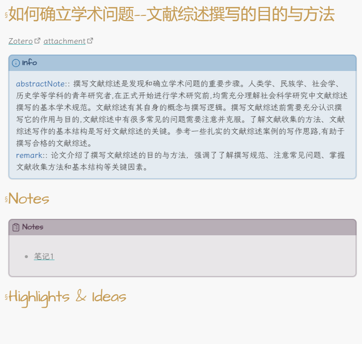

Obsidian ZotLit模板速查表[^template-cheatsheet]

# 前置插件
- `ZotLit`[^zotlit] 1.1.5

# 模板
## `zt-annot.eta`
需要根据自己的标注配色方案更改



```
[!note] <% if (it.color == '#ffd400') { %>概念<% } %><% else if(it.color == '#5fb236') { %>创新点<% }%><% else if(it.color == '#2ea8e5') { %>研究方法<% }%><% else if(it.color == '#a28ae5') { %>研究假设<% }%><% else if(it.color == '#d2d8e2') { %>图表标注<% }%><% else if(it.color == '#f19837') { %>重要结论<% }%><% else if(it.color == '#aaaaaa') { %>有疑问<% }%>
<%= it.imgEmbed %><%= it.text %><% if (it.comment) { %>
==💬<%= it.comment %>==
<% } %>
```

## `zt-annots.eta`
默认模板

```
<% for (const annotation of it) { %>
<%~ include("annotation", annotation) %>
<% } %>
```

## `zt-cite.eta`


```
<%= it.map(lit => `[[@${lit.citekey}|(${lit.authors.map(v => v.lastName+v.firstName).first()}${lit.authors.length>1?" et al.":""}, ${lit.year?lit.year:lit.date})]]`).join("; ") %>
```

## `zt-cite2.eta`


```
<%= it.map(lit => `[[@${lit.citekey}|${lit.authors.map(v => v.lastName+v.firstName).first()}${lit.authors.length>1?", et al":""}. ${lit.year?lit.year:lit.date}. ${lit.title}.]]`).join("; ") %>
```

## `zt-colored.eta`


```
<mark style="
<%- if (it.color) { _%> color: <%= it.color %>; <%_ } -%>
<%- if (it.bgColor) { _%> background-color: <%= it.bgColor %>; <%_ } -%>
"><%= it.content %></mark>
```

## `zt-field.eta`
YAML区样式由主题Ebullientworks提供,不同主题不一样



```
created-date: <%= it.dateAdded.substring(0,10) %>
citekey: "<%= it.citekey %>"
title: <% if (it.language=='zh-CN') { %>
  <%= it.title %>
<% } else if(it.language=='en-US') { %>
  <% var Translation = ''; it.extra[0].split('\n').forEach(function(line){ if (line.startsWith('titleTranslation: ')) { Translation = line.split('titleTranslation: ')[1]; } }); %>
  <%= Translation %>
<% } %>
publication: <% if (it.publicationTitle) { %>"[[<%= it.publicationTitle %>]]"<% } %>
publication-year: <%= it.date %>
author: <% if (it.language=='en-US') { %>
<% it.authors.forEach(function(author) { %>
  - "[[<%= author %>]]"
<% }); %>
<% } else if (it.language=='zh-CN') { %>
<% it.authors.forEach(function(author) { %>
  - "[[<%= author.lastName + author.firstName %>]]"
<% }); %>
<% } %>
tags:<% if (it.tags) { %>
<% it.tags.forEach(function(tag) { %>
  <% if (tag.type === 0) { %>
  - "<%= tag %>"
  <% } %>
<% }); %>
<% } %>
```

## `zt-note.eta`


```
# <%= it.title %>

[Zotero](<%= it.backlink %>) <%= it.fileLink %>

> [!info] Info
> **abstractNote**:: <% if (it.language=='zh-CN') { %><%= it.abstractNote.first().replace(/[\r\n]+/g, " ") %><% } %><%else if(it.language=='en-US') { %><% var Translation = ''; it.extra[0].split('\n').forEach(function(line){ if (line.startsWith('abstractTranslation: ')) { Translation = line.split('abstractTranslation: ')[1]; } }); %><%= Translation %><% } %>
<% var remark = ''; it.extra[0].split('\n').forEach(function(line){ if (line.startsWith('remark: ')) { remark = line.split('remark: ')[1]; } }); %><% if (remark) { %>> **remark**:: <%= remark %><% } %>

# Notes
> [!summary] Notes
> ```dataview
> list from [[]] and !outgoing([[]]) 
> ```

# Highlights & Ideas

```

[^template-cheatsheet]: [template-cheatsheet](https://zotlit.aidenlx.top/zh-CN/how-to/template-cheatsheet)
[^zotlit]: [PKM-er/obsidian-zotlit: A third-party project that aims to facilitate the integration between Obsidian.md and Zotero, by providing a set of community plugins for both Obsidian and Zotero](https://github.com/PKM-er/obsidian-zotlit)